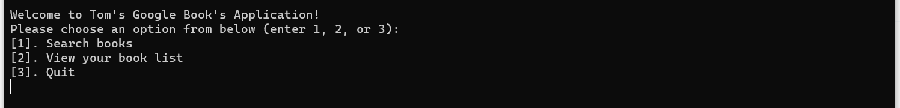
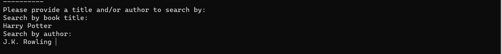
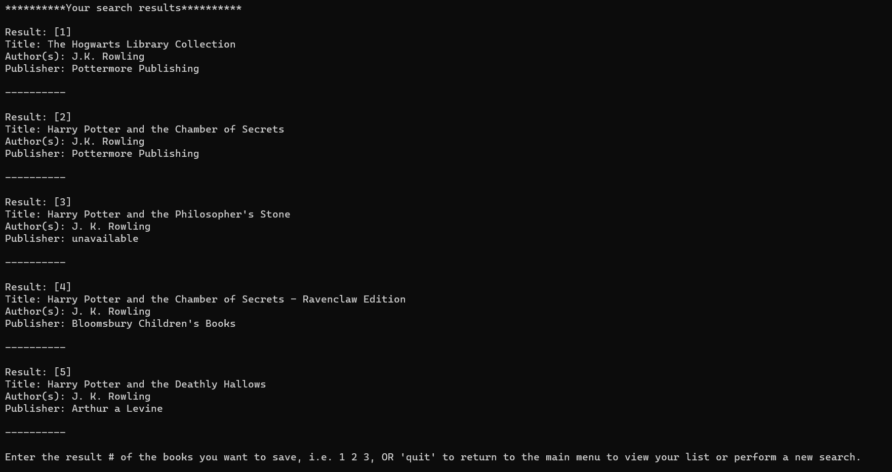
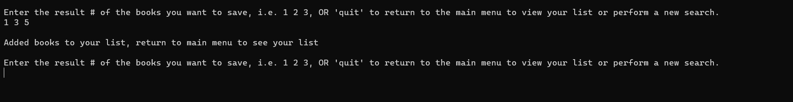
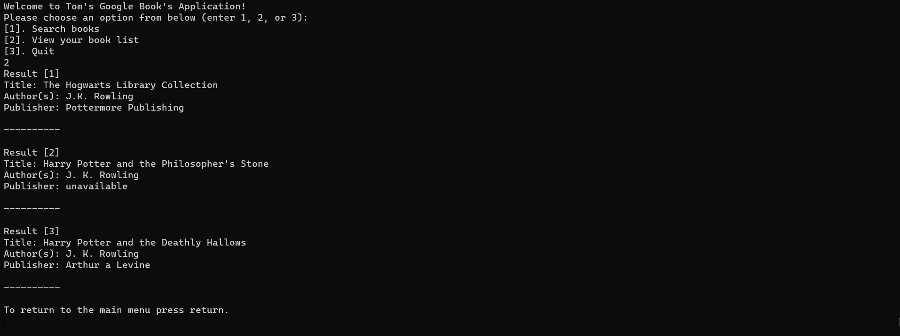

# Google Books Application 

This command line application allows you to interact with the Google Books API by searching for books based upon title and author inputs. The application will display a list of 5 results from each search, and allow users to save results to a reading list. The information displayed for each search contains a book's title, author, and publisher. If any of these fields are unavailable from the Google Books API, the field will indicate unavailable. 

## Environment and Dependencies 

* Node 14.3.0
* axios 0.21.1
* prompt-sync 4.2.0

## Tests

* Chai 4.3.4
* Mocha 9.0.0

## Usage 

This applications requires Node. 

Clone this repository https://github.com/tom-cheung/Google-Books-Application.git, CD into the main file, run `npm install` to install all dependencies, lastly run `npm run start`.

Users will be prompted with the following, 

## Main Menu 

An input of 1 brings up the search menu, where the user is prompted for `title` and/or `author` input. Input must be provided for at least one of the criterias. 

Once input is provided, the application queries the Google Books API and returns 5 results. 

Once the results are shown, the user is prompted to either enter the `result #` of the book(s) they want to save to their reading list, or `quit` to return to the main menu. If the user wants to save a book they will need to enter the result #'s seperated by spaces. 

After saving books to their reading lists, users can return to the main menu and view their saved books. 

